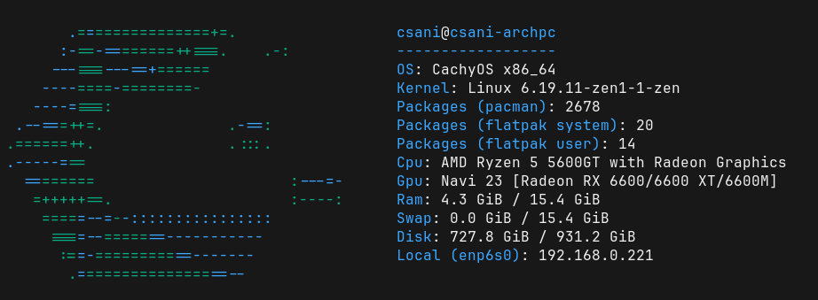

# pyfetch
A fetch tool made in python

## Configuration
Config should be here: ~/.config/pyfetch/config.toml
Example configuration avaiable 

## Bugs
If you find bugs feel free to make a github issue

## Install
1. Run install.sh
2. Installed!
